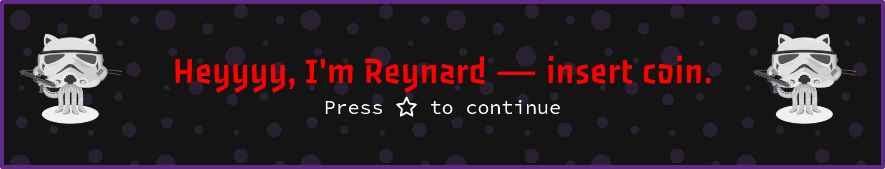

  

- 🔭 I’m currently developing **Payment-related Embedded Systems**
- 🌱 I’m currently learning **Go and Game Dev basics**
- 💬 Ask me about **Video Games**
- ⚡ Quote: **“What is a man? A miserable little pile of secrets!” -Castlevania**

<h3 align="left">My Stuff:</h3>

                        

<picture>
  <source
    media="(prefers-color-scheme: dark)"
    srcset="https://raw.githubusercontent.com/moeinEN/moeinEN/refs/heads/github-breakout/images/breakout-dark.svg"
  />
  <source
    media="(prefers-color-scheme: light)"
    srcset="https://raw.githubusercontent.com/moeinEN/moeinEN/refs/heads/github-breakout/images/breakout-light.svg"
  />
  
</picture>

<h2 align="center">My visitors</h2>

  

